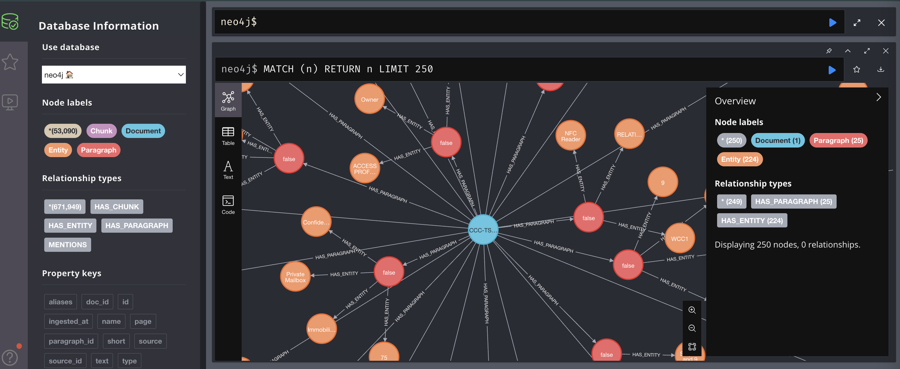
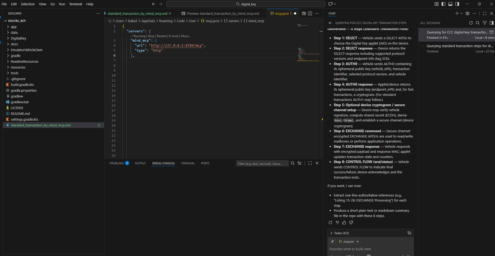
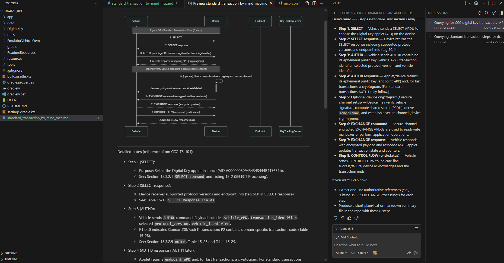

# MCP GraphRAG (LangExtract)

## Requirements

- Neo4j running at `http://localhost:7474`
- Qdrant running at `http://localhost:6333`

## Install

```bash
pip install -r requirements.txt
python -m spacy download en_core_web_sm
```

## Default entity model (GLiNER)

The default entity model is `gliner_medium-v2.1`.

- Local/offline (recommended):

```bash
export GLINER_MODEL_PATH=/Users/youruser/tool/ai/gliner_medium-v2.1
```

- Or use model name (download from Hugging Face):

```
GLINER_MODEL_NAME=urchade/gliner_mediumv2
```

### Quick comparison: GLiNER vs spaCy

- **GLiNER**: zero-shot, flexible labels, often better for domain-specific entities.
- **spaCy**: fast and stable, easy with `EntityRuler`, but uses fixed labels per model.

## Embedding model (offline)

If your environment blocks Hugging Face downloads, set a local path:

```bash
export EMBEDDING_MODEL_PATH=/Users/youruser/tool/ai/all-MiniLM-L6-v2
```

When set, `mcp_graph_rag.py` will load embeddings from `EMBEDDING_MODEL_PATH`.

## `.env` config (auto-loaded)

Create `.env` at the repo root:

```
NEO4J_URI=bolt://localhost:7687
NEO4J_USER=neo4j
NEO4J_PASS=neo4j_pass
QDRANT_HOST=localhost
QDRANT_PORT=6333
QDRANT_COLLECTION=graphrag_entities

EMBEDDING_MODEL=sentence-transformers/all-MiniLM-L6-v2
EMBEDDING_MODEL_PATH=/Users/youruser/tool/ai/all-MiniLM-L6-v2
GLINER_MODEL_NAME=urchade/gliner_mediumv2
GLINER_MODEL_PATH=/Users/youruser/tool/ai/gliner_medium-v2.1
EMBEDDING_LOCAL_ONLY=1
GLINER_LOCAL_ONLY=1
HF_HUB_OFFLINE=1
TRANSFORMERS_OFFLINE=1

DEFAULT_ENTITY_TYPES=ORG,PRODUCT,STANDARD,TECH,CRYPTO,SECURITY,PROTOCOL,VEHICLE,DEVICE,SERVER,APP,CERTIFICATE,KEY
AZURE_OPENAI_API_KEY=xxxxxx
AZURE_OPENAI_ENDPOINT=xxxx
AZURE_OPENAI_DEPLOYMENT=xxx
AZURE_OPENAI_API_VERSION=xxx

LANGEXTRACT_API_KEY=your_key
LANGEXTRACT_MODEL_ID=gemini-2.5-flash
```

## Run MCP server

```bash
python mcp_graph_rag.py --transport streamable-http
```

Endpoint:

```
http://127.0.0.1:8789/mcp
```

## MCP config

```
{
  "servers": {
    "mind_mcp": {
      "url": "http://127.0.0.1:8789/mcp",
      "type": "http"
    }
  }
}
```

## MCP tools

- `query_graph_rag_langextract(query, top_k, source_id, collection, include_entities, include_relations, expand_related, related_k, graph_depth, entity_types, max_passage_chars, min_score_to_expand, min_entity_occurrences)`
- `list_source_ids(limit)`
- `list_qdrant_collections()`
- `get_paragraph_text(source_id, paragraph_id)`

## Ingest flow (GraphRAG LangExtract)

### Step 1: run `graphrag_ingest_langextract.py`

This command:

- Reads input (`--pdf`, `--text-file`, `--md`, `--docx`, `--pptx`, `--xlsx`, `--raw-text`, or `--folder`).
- Splits text into paragraphs and builds embeddings per paragraph.
- Calls LangExtract to extract entities and relations.
- Stores data in:
  - **Qdrant**: passage + embedding (payload includes `source_id`, `paragraph_id`, `entity_ids`, `entity_mentions`).
  - **Neo4j**: `Document`, `Paragraph`, `Entity`, and their relationships (entities merge by normalized name+type). `HAS_ENTITY` includes confidence + span metadata when available.

Result: after ingest, you can call `query_graph_rag_langextract` and use the `entity_ids` bridge to expand context via Neo4j.

Pipeline (ingest):

```
input -> chunk/paragraph -> embeddings -> LangExtract -> Qdrant(payload+vectors)
                                                -> Neo4j(entities+relations)
```

## `graphrag_ingest_langextract.py` parameters (full list)

Exactly one input source is required: `--pdf`, `--text-file`, `--md`, `--docx`, `--pptx`, `--xlsx`, `--raw-text`, or `--folder`.

### Grouped reference

**Input**
- `--pdf`: Path to a single PDF file.
- `--text-file`: Path to a UTF-8 text file (.txt).
- `--md`: Path to a UTF-8 Markdown file (.md).
- `--docx`: Path to a Word document (.docx).
- `--pptx`: Path to a PowerPoint file (.pptx).
- `--xlsx`: Path to an Excel file (.xlsx).
- `--raw-text`: Raw text input string (quoted).
- `--folder`: Folder to scan recursively for `.pdf`, `.txt`, `.md`, `.docx`, `.pptx`, and `.xlsx`.
- `--source-id`: Override `source_id` stored in Qdrant payload and Neo4j.

**Paragraphing + embeddings**
- `--collection`: Qdrant collection name (default: `graphrag_entities`).
- `--embedding-model`: Override embedding model name/path.
- `--max-paragraph-chars`: Max chars per paragraph (default: `1200`).
- `--min-paragraph-chars`: Min chars to keep a paragraph (default: `150`).
- `--skip-llm-short`: Skip LLM for short paragraphs, still store in Qdrant.

**Entity extraction**
- `--entity-provider`: Entity extractor: `spacy`, `gliner`, `gemini`, or `langextract` (default: `gliner`).
- `--spacy-model`: spaCy model name (default: `en_core_web_sm`).
- `--ruler-json`: Path to spaCy `EntityRuler` JSON.
- `--gliner-model-name`: GLiNER model name (default: `urchade/gliner_mediumv2`).
- `--gliner-model-path`: Local GLiNER model path (recommended for offline).
- `--gliner-model`: Deprecated alias; use `--gliner-model-name` or `--gliner-model-path`.
- `--gliner-labels`: Comma-separated labels or path to text file (one label per line).
- `--gliner-threshold`: GLiNER confidence threshold (default: `0.3`).
- `--gliner-batch-size`: Batch size for GLiNER extraction (default: `8`).
- `--no-entity-merge`: Do not merge entities across paragraphs (per-paragraph IDs).
- `--entity-normalize-mode`: Entity normalization strength for merging (`basic` or `aggressive`, default: `aggressive`).
- `--no-batch`: Disable batching for GLiNER and Neo4j (sequential processing).
- `--langextract-model-id`: Override `LANGEXTRACT_MODEL_ID` for LangExtract.
- `--langextract-model-url`: Override `LANGEXTRACT_MODEL_URL` (e.g., Ollama URL).
- `--llm-debug`: Print raw LLM output and log to `logs/langextract_raw.log`.
- `--llm-retry-count`: Retry count when LLM output parsing fails.
- `--llm-retry-backoff`: Backoff seconds between LLM retries.

**Neo4j + Qdrant**
- `--neo4j-uri`: Neo4j URI (default from `NEO4J_URI`).
- `--neo4j-user`: Neo4j user (default from `NEO4J_USER`).
- `--neo4j-pass`: Neo4j password (default from `NEO4J_PASS`).
- `--neo4j-batch-size`: Number of paragraphs written per Neo4j batch (default: `50`).
- `--qdrant-url`: Qdrant URL (if set, overrides host/port).
- `--qdrant-host`: Qdrant host (default from `QDRANT_HOST`).
- `--qdrant-port`: Qdrant port (default from `QDRANT_PORT`).
- `--qdrant-api-key`: Qdrant API key (default from `QDRANT_KEY`).

### Compact table

| Group | Parameter | Description | Default |
| --- | --- | --- | --- |
| Input | `--pdf` | Path to a single PDF file | `None` |
| Input | `--text-file` | Path to a UTF-8 text file (.txt) | `None` |
| Input | `--md` | Path to a UTF-8 Markdown file (.md) | `None` |
| Input | `--docx` | Path to a Word document (.docx) | `None` |
| Input | `--pptx` | Path to a PowerPoint file (.pptx) | `None` |
| Input | `--xlsx` | Path to an Excel file (.xlsx) | `None` |
| Input | `--raw-text` | Raw text input string | `None` |
| Input | `--folder` | Folder to scan recursively for `.pdf`, `.txt`, `.md`, `.docx`, `.pptx`, and `.xlsx` | `None` |
| Input | `--source-id` | Override `source_id` stored in Qdrant/Neo4j | `None` |
| Embed | `--collection` | Qdrant collection name | `graphrag_entities` |
| Embed | `--embedding-model` | Override embedding model name/path | `None` |
| Embed | `--max-paragraph-chars` | Max chars per paragraph | `1200` |
| Embed | `--min-paragraph-chars` | Min chars per paragraph | `150` |
| Embed | `--skip-llm-short` | Skip LLM for short paragraphs | `false` |
| Entity | `--entity-provider` | `spacy`, `gliner`, `gemini`, `langextract` | `gliner` |
| Entity | `--spacy-model` | spaCy model name | `en_core_web_sm` |
| Entity | `--ruler-json` | spaCy EntityRuler JSON | `None` |
| Entity | `--gliner-model-name` | GLiNER model name | `urchade/gliner_mediumv2` |
| Entity | `--gliner-model-path` | Local GLiNER model path | env `GLINER_MODEL_PATH` |
| Entity | `--gliner-model` | Deprecated alias | `None` |
| Entity | `--gliner-labels` | Labels (CSV or file path) | `PERSON,ORG,PRODUCT,GPE,DATE,TECH,CRYPTO,STANDARD` |
| Entity | `--gliner-threshold` | GLiNER confidence threshold | `0.3` |
| Entity | `--gliner-batch-size` | GLiNER extraction batch size | `8` |
| Entity | `--no-entity-merge` | Do not merge entities across paragraphs | `false` |
| Entity | `--entity-normalize-mode` | Entity normalization strength | `aggressive` |
| Entity | `--no-batch` | Disable batching (sequential processing) | `false` |
| Entity | `--langextract-model-id` | Override LangExtract model id | env `LANGEXTRACT_MODEL_ID` |
| Entity | `--langextract-model-url` | Override LangExtract URL | env `LANGEXTRACT_MODEL_URL` |
| LLM | `--llm-debug` | Print raw LLM output | `false` |
| LLM | `--llm-retry-count` | Retry count on parse fail | `None` |
| LLM | `--llm-retry-backoff` | Backoff seconds | `None` |
| Neo4j | `--neo4j-uri` | Neo4j URI | env `NEO4J_URI` |
| Neo4j | `--neo4j-user` | Neo4j user | env `NEO4J_USER` |
| Neo4j | `--neo4j-pass` | Neo4j password | env `NEO4J_PASS` |
| Neo4j | `--neo4j-batch-size` | Paragraphs per batch write | `50` |
| Qdrant | `--qdrant-url` | Qdrant URL (overrides host/port) | env `QDRANT_URL` |
| Qdrant | `--qdrant-host` | Qdrant host | env `QDRANT_HOST` |
| Qdrant | `--qdrant-port` | Qdrant port | env `QDRANT_PORT` |
| Qdrant | `--qdrant-api-key` | Qdrant API key | env `QDRANT_KEY` |

- `--pdf`: Path to a single PDF file.
- `--text-file`: Path to a UTF-8 text file (.txt).
- `--md`: Path to a UTF-8 Markdown file (.md).
- `--docx`: Path to a Word document (.docx).
- `--pptx`: Path to a PowerPoint file (.pptx).
- `--xlsx`: Path to an Excel file (.xlsx).
- `--raw-text`: Raw text input string (quoted).
- `--folder`: Folder to scan recursively for `.pdf`, `.txt`, `.md`, `.docx`, `.pptx`, and `.xlsx`.
- `--source-id`: Override `source_id` stored in Qdrant payload and Neo4j.
- `--collection`: Qdrant collection name (default: `graphrag_entities`).
- `--embedding-model`: Override embedding model name/path.
- `--max-paragraph-chars`: Max chars per paragraph (default: `1200`).
- `--min-paragraph-chars`: Min chars to keep a paragraph (default: `150`).
- `--skip-llm-short`: Skip LLM for short paragraphs, still store in Qdrant.
- `--entity-provider`: Entity extractor: `spacy`, `gliner`, `gemini`, or `langextract` (default: `gliner`).
- `--spacy-model`: spaCy model name (default: `en_core_web_sm`).
- `--ruler-json`: Path to spaCy `EntityRuler` JSON.
- `--gliner-model-name`: GLiNER model name (default: `urchade/gliner_mediumv2`).
- `--gliner-model-path`: Local GLiNER model path (recommended for offline).
- `--gliner-model`: Deprecated alias; use `--gliner-model-name` or `--gliner-model-path`.
- `--gliner-labels`: Comma-separated labels or path to text file (one label per line).
- `--gliner-threshold`: GLiNER confidence threshold (default: `0.3`).
- `--gliner-batch-size`: Batch size for GLiNER extraction (default: `8`).
- `--no-entity-merge`: Do not merge entities across paragraphs (per-paragraph IDs).
- `--entity-normalize-mode`: Entity normalization strength for merging (`basic` or `aggressive`, default: `aggressive`).
- `--no-batch`: Disable batching for GLiNER and Neo4j (sequential processing).
- `--langextract-model-id`: Override `LANGEXTRACT_MODEL_ID` for LangExtract.
- `--langextract-model-url`: Override `LANGEXTRACT_MODEL_URL` (e.g., Ollama URL).
- `--llm-debug`: Print raw LLM output and log to `logs/langextract_raw.log`.
- `--llm-retry-count`: Retry count when LLM output parsing fails.
- `--llm-retry-backoff`: Backoff seconds between LLM retries.
- `--neo4j-uri`: Neo4j URI (default from `NEO4J_URI`).
- `--neo4j-user`: Neo4j user (default from `NEO4J_USER`).
- `--neo4j-pass`: Neo4j password (default from `NEO4J_PASS`).
- `--neo4j-batch-size`: Number of paragraphs written per Neo4j batch (default: `50`).
- `--qdrant-url`: Qdrant URL (if set, overrides host/port).
- `--qdrant-host`: Qdrant host (default from `QDRANT_HOST`).
- `--qdrant-port`: Qdrant port (default from `QDRANT_PORT`).
- `--qdrant-api-key`: Qdrant API key (default from `QDRANT_KEY`).

### Example (GLiNER)

```bash
python graphrag_ingest_langextract.py \
  --folder /path/to/folder \
  --entity-provider gliner \
  --gliner-model-name urchade/gliner_mediumv2 \
  --gliner-labels gliner/labels_digital_key.txt \
  --gliner-threshold 0.35 \
  --gliner-batch-size 1 \
  --neo4j-batch-size 1 \
  --neo4j-pass neo4j_pass
```

```bash
python graphrag_ingest_langextract.py \
  --folder /path/to/folder \
  --entity-provider gliner \
  --gliner-model-name urchade/gliner_mediumv2 \
  --gliner-labels gliner/labels_digital_key.txt \
  --gliner-threshold 0.35 \
  --gliner-batch-size 1 \
  --no-batch \
  --neo4j-pass neo4j_pass
```

### Example (Single file inputs)

```bash
python graphrag_ingest_langextract.py --md /path/to/file.md --neo4j-pass neo4j_pass
```

```bash
python graphrag_ingest_langextract.py --docx /path/to/file.docx --neo4j-pass neo4j_pass
```

```bash
python graphrag_ingest_langextract.py --pptx /path/to/file.pptx --neo4j-pass neo4j_pass
```

```bash
python graphrag_ingest_langextract.py --text-file /path/to/file.txt --neo4j-pass neo4j_pass
```

```bash
python graphrag_ingest_langextract.py --xlsx /path/to/file.xlsx --neo4j-pass neo4j_pass
```
### Example (LangExtract + Ollama)

```bash
python graphrag_ingest_langextract.py \
  --pdf /path/to/file.pdf \
  --entity-provider langextract \
  --langextract-model-id gemma2:2b \
  --langextract-model-url http://localhost:11434 \
  --neo4j-pass neo4j_pass
```

### Example (LangExtract + Gemini)

```bash
export LANGEXTRACT_API_KEY=your_gemini_key

python graphrag_ingest_langextract.py \
  --pdf /path/to/file.pdf \
  --entity-provider langextract \
  --langextract-model-id gemini-2.5-flash \
  --neo4j-pass neo4j_pass
```

### Example (LangExtract + OpenAI)

```bash
export LANGEXTRACT_API_KEY=your_openai_key

python graphrag_ingest_langextract.py \
  --pdf /path/to/file.pdf \
  --entity-provider langextract \
  --langextract-model-id gpt-4o \
  --neo4j-pass neo4j_pass
```

### Example (LangExtract + Azure OpenAI)

```bash
export LANGEXTRACT_API_KEY=your_azure_key
export AZURE_OPENAI_ENDPOINT=https://<your-resource>.openai.azure.com
export AZURE_OPENAI_DEPLOYMENT=your_deployment
export AZURE_OPENAI_API_VERSION=2024-02-15-preview

python graphrag_ingest_langextract.py \
  --pdf /path/to/file.pdf \
  --entity-provider langextract \
  --langextract-model-id gpt-4o \
  --neo4j-pass neo4j_pass
```

### Example (Reset Neo4j + Qdrant)

```bash
python 0_reset_all.py --neo4j-pass neo4j_pass
```

## Query flow (GraphRAG LangExtract)

### What does `query_graph_rag_langextract` do?

Two main steps:

1) **Search Qdrant** with the query embedding to get top-k passages
2) **Expand via Neo4j** using `entity_ids` from those passages

### Where does it query, what data comes from each DB?

- **Qdrant**: embeddings + passages. The tool:
  - finds top-k passages,
  - reads payload fields `source_id`, `paragraph_id`, `entity_ids`, `entity_mentions`.
- **Neo4j**: entities + relations. The tool:
  - resolves entities by `entity_ids`,
  - optionally expands relations (`include_relations`, `expand_related`, `related_k`, `graph_depth`),
  - can gate expansion using `min_score_to_expand` / `min_entity_occurrences`.

### Special points

- Uses `source_id` to link passages with Neo4j.
- The bridge between Qdrant and Neo4j is **`entity_ids`** from LangExtract/GLiNER ingest.(you can choose another, such as spaCy)
- `entity_mentions` in Qdrant payload contains span/metadata when available.
- Relation expansion is optional to balance speed vs depth.
- Gating expansion: use `min_score_to_expand` and `min_entity_occurrences` to reduce noisy graph expansions.

Pipeline (query):

```
query -> embedding -> Qdrant(top-k passages + entity_ids)
                 -> Neo4j(entities/relations expansion)
                 -> response context
```

## Sample commands

```
list_qdrant_collections()
```

```
list_source_ids(limit=50)
```

### Example ingest with normalization + metadata

```bash
python graphrag_ingest_langextract.py \
  --folder ./data \
  --entity-provider gliner \
  --entity-normalize-mode aggressive \
  --gliner-threshold 0.35 \
  --collection graphrag_entities
```

```bash
python graphrag_ingest_langextract.py \
  --md ./docs/spec.md \
  --entity-provider langextract \
  --entity-normalize-mode basic \
  --collection graphrag_entities
```

```
query_graph_rag_langextract(
  query="Digital Key encryption info",
  top_k=5,
  collection="graphrag_entities",
  source_id="my_doc",
  include_entities=true,
  include_relations=true,
  graph_depth=1,
  min_score_to_expand=null,
  min_entity_occurrences=null,
  related_k=50,
  max_passage_chars=800
)
```

``` 
query_graph_rag_langextract(
  query="zero trust policy for device identity",
  top_k=8,
  collection="graphrag_entities",
  include_entities=true,
  include_relations=true,
  graph_depth=2,
  min_score_to_expand=0.25,
  min_entity_occurrences=2,
  related_k=80,
  max_passage_chars=900
)
```

Notes:
- `graph_depth=2` helps expand to second-order neighbors for discovery-style queries.
- `min_entity_occurrences=2` reduces noise by expanding only entities that appear in multiple top passages.
# Graph RAG



# Config MCP



# Use GraphRAG to create sequences diagram from Document



## Changelog (local)

- Added graph expansion controls (`graph_depth`, `min_score_to_expand`, `min_entity_occurrences`) to query.
- Ingest now stores entity metadata (confidence, span) in Neo4j `HAS_ENTITY` and Qdrant `entity_mentions`.
- Added `--entity-normalize-mode` to control merge normalization strength.
